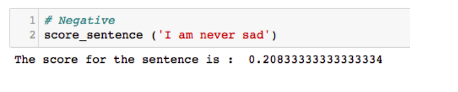

Analysis Of Happy Moments
=========================
## CONTRIBUTORS
[Akshat Choube]() - 111501031, [Harsh Yadav]() - 111501009, [Chirag]()-(101501011)

Motivation 
===========

To psychological researchers, happiness is life experience marked by a
preponderance of positive emotion. Feelings of happiness and thoughts of
satisfaction with life are two prime components of subjective well-being
(SWB). Thus, understanding true source or reasons of happiness is an
interesting and useful task. Understanding happiness is not
straightforward, rather it highly depends on past experience of an
individual, but there are some commonalities between happiness similar
group can be extracted out. Understanding happiness will help us to
build applications that makes people happy. Another important task is to
score positivity or negativity of a sentence using some scoring
criteria. Assigning scores to a sentence can help us figure out from
public data like tweets and posts, the writers subjective opinion and/or
state of mind while writing it. This information is pretty useful in
applications such as movie reviews, etc. Categorizing happy moments
helps us to better understand their source. Thus happiness is something
we all seek and is important to know its basic cause and reasons.

Problem Formulation 
====================

The science of happiness is an area of positive psychology concerned
with understanding what behaviors make people happy in a sustainable
fashion. We want to build a model which would give us a clear and better
understanding of how people express their happy moments. To achieve
this, we are using a dataset named HappyDB, a corpus of 100,000 happy
moments. The dataset contains answers to the queries that correlate
happy moments with the past history i.e what made people happy in the
past 24 hours or alternatively, past 3 months. HappyDB also contains
information about demographic characteristics of the person such as age,
marital status, nationality etc.

Three main tasks we plan to accomplish in this project are:

1.  Analyzing happy Moments among people of different age groups, sex,
    nationality etc. and understanding their source of happiness.

2.  Categorize each happy moment into these listed categories:

    1.  Achievement

    2.  Affection

    3.  Bonding

    4.  Enjoying the moment

    5.  Exercise

    6.  Leisure

    7.  Nature

3.  Building a heuristics to score positivity or negativity of
    a sentence.

We show steps taken for accomplishing aforementioned tasks in following
sections.

Running the code
================
Repository contains 4 python files:
1.  Preprocess.py :  contains all preprocessing functions
2.  Lstm.py : run this to train lstm and this generates an outup prediction csv file.
3.  valenceshifters.py : contains algorithm to score sentences and generates text file containing scores of sentences
4.  Analysis.py : contains code for query builder and analyser using wordcloud.

HappyDB contains 2 data files:-
1.  Cleaned_hm :- Contains hmid (happy moment id), wid (worker's id), reflection_period, original_hm,cleaned_hm, num_sentence, ground_truth_category, predicted category.
2.  Demographic.csv :- Contains information about worker like age, country,gender, marital, parenthood 

Algorithms/Models
=================

Analyzing Source of Happiness among people of different age, sex, nationality etc.
----------------------------------------------------------------------------------

Demographic.csv file contains demographic information about workers like
their age, sex, marital status etc. which is used to get desired subset
of population. We then look into their happy moments and collect most
frequent words occurring in them.Then we visualize and analyze the
results by making a word cloud. We have build a query builder using
which we can query our data based on demographic or happiness
information and get desired word cloud. for example What things make an
Indian happy whose age is between 18 to 25 and happiness category is
affection.

Categorizing Happy Moments
--------------------------

We trained a Long Short Term Memory (LSTM) for categorizing happy
moments to seven categories mentioned below.

We chose LSTM because unlike algorithm involving Bag of words which
ignores semantics of words and loose ordering of words whereas LSTM
considers it. To convert happy moment $h$ to input layer $x$ we need to
get a sequence of words into vector representation $x$ to feed it as the
input layer to the network. This is done in the following way:

-   Each happy moment (set of sentences) is represented by a integer
    vector which is frequencies of corresponding words of sentences in a
    corpus consisting of all happy moments.

-   An embedding layer projects each of the these vectors into a
    d-dimensional continuous vector space. This is done by multiplying
    the these vector from left with weight matrix $W\in R^{dlvl}$ .
    Where: $|V|$ is the number of unique words in vocabulary
    $e_{t}=WX_{t}$.

-   After the embedding layer, the input sequence of vectors becomes a
    sequence of dense, real valued vectors $(e_{1},e_{2},...,e_{T})$ .

-   Output $y_{i}$ for each happy moment sis represented as one hot
    vector eg. $[1,0,0,0,0,0,0]$ denotes achievement.

After embedding layer we can add LSTM layer with many memory units and
then the softmax output layer. Recurrent Neural networks like LSTM
generally have the problem of overfitting. Dropout can be applied
between layers using the Dropout layer to tackle vanishing gradient
problem.

Assigning a score to each happy moment
--------------------------------------

### Naive Model : 

The initial understanding of assigning a happiness index to a sentence
was only the difference between the positive and negative score of each
word.

The Algorithm is as under :

1.  Given a sentence, preprocess it to find the tokens in the sentence.

2.  For each word in tokens

    1.  Positive score = average positive score of all words in
        its synset.

    2.  Negative score = average negative score of all words in
        its synset.

3.  Net score = positive score - negative score / length of sentence

### Final Model

The initial algorithm worked for elementary and straightforward
sentences. However, the fact that a positive sentence may not only
contain positive words and vice versa made us think otherwise. For
example, consider following sentences:

1.  It was a happy day for me because I excelled in a test. (This
    sentence is straightforward and would be scored correctly by
    naive model)

2.  John is not good. (This would be scored as positive sentence by
    naive model as good has a high positive value)

The Final model includes concept of valence shifters and thus does not
suffer from above mentioned anomaly. The Algorithm is as follows

1.  Given a sentence, preprocess it to find the tokens in the sentence.

2.  Using POS tagging mechanism, tag every token as a part of speech.

3.  Filter tokens that have a non-zero sentiwordnet score, have POS tag
    in \[noun, verb, adverb, coordinating
    conjunction\] or belongs to contextual valence
    shifter family.

4.  For each word in tokens

    1.  Positive score = average positive score of all words in
        its synset.

    2.  Negative score = average negative score of all words in
        its synset.

5.  For each word in tokens

    1.  If word is presuppositional

        1.  Flip the score of the next word with non-zero score.

    2.  If word is a connector

        1.  Edit the score of all the tokens before this word to zero

    3.  If word is negative

        1.  Flip the score of the next word with non-zero score.

    4.  If word is intensifier

        1.  Multiplies the score of the next word with 1.5

6.  Score of the sentence = sum (score of tokens) / number of tokens

Implementation and Results:
===========================

Data Set 
---------

HappyDB dataset contains two files

1.  Cleaned\_hm :- Contains hmid (happy moment id), wid (workers id),
    reflection\_period, original\_hm, cleaned\_hm, num\_sentence,
    ground\_truth\_category, predicted category.

    

2.  Demographic.csv :- Contains information about worker like age,
    country, gender, marital, parenthood.

    

Preprocessing of data:
----------------------

1.  Cleansing:- HappyDB already contains cleaned version of data.

2.  Text Processing:-

    1.  Tokenize

    2.  Transform to lowercase

    3.  Stemming

    4.  Removal of stop words is not necessary as they also have a
        sentiment value

3.  Build word dictionary

4.  All happy moments are tokenized and stored in a file. so we don’t
    have to tokenize again and again.

Task 1 Results
--------------

We generated Word clouds for some sections of population and analyzed
them to get some results.(We can generate wordcloud for any section
using query builder. Some of results are shown here)

### Different Age Groups

1.  18 - 25 years

    

    At this age major source of happiness of people are from friends,
    watching or playing games, success in work etc.

2.  25 - 45 years

    

    For this age group we have words like son, daughter, wife which was
    absent from above age group. As seen friends still play a major role
    in determining happiness but it’s count is less as compared
    to before.

3.  45 - 60 years

    

    Reasons like Husband, Wife, Daughter and Son (family) becomes major
    source of happiness. People find happiness in spending time and
    sharing love with family and dog.

### Based on Gender

1.  Male

    

    Things that made a man happy were friend, work, wife, playing,
    dinner, night, girlfriend.

2.  Female

    

    Things that make a woman happy were friend, daughter, son, husband,
    work, love.

Notice that happiness among man and woman are substantially different.

### Based on Marital status

1.  Married

    

    Things that makes married people happy are friend, family, work,
    time, daughter, son, etc.

2.  Single

    

### Based on nationality

1.  India

    

2.  USA

    

Friends and family are common source of happiness. words like dog,
dinner, game etc. don’t appear for Indians. Words like brother, sister,
movie don’t appear for Americans.

### Based on Reflection Period 

1.  24 hours

    

2.  3 months

    

Words like birthday, bought don’t appear for 24 h for obvious reasons.
But these two have a lot of similarities.

### Another Word cloud 

These are happy words related to affection for Indians where son occurs
pretty much often than daughter.

Implementation of Task 2 
-------------------------

LSTM model was trained and predictions were stored in a csv file name
after\_prediction.csv. Prediction accuracy 80.3 % was achieved which is
good considering little ambiguity in various happy moments. for example
: I was happy because we celebrated my mom’s birthday yesterday, this
can be affection as well as enjoy the moment. We had less training data,
accuracy can be improved by increasing training data size.

Our Prediction results on some data is shown below

Implementation of Task 3
------------------------

Applying the above algorithm to rate sentences using contextual valence
shifters on our happydb, we get the following result:

1.  Arranging with most positive first

    

2.  Test cases:

    1.  Presuppositional words:

        

    2.  Intensifiers:

        

    3.  Negatives:

        

    4.  Connectors:

        

Conclusion
==========

We find happiness in daily trivial and fundamental activities which
motivates us to move further in life. Thus performing the tasks planned
for this project made us understand psychology of happiness better and
made us understand true sources of various kinds of happiness. On the
technical side, this project introduced us to state of art NLP
techniques and deep learning.

References :
============

1.  HappyDB: A Corpus of 100,000 Crowdsourced Happy Moments : Link :
    https://arxiv.org/pdf/1801.07746.pdf

2.  Predicting happiness: user interactions and sentiment analysis in an
    online travel forum : Link :
    https://link.springer.com/content/pdf/10.1007%2Fs40558-017-0079-2.pdf

3.  Sequence Classification with LSTM Recurrent Neural Networks in
    Python with Keras . Link:
    https://machinelearningmastery.com/sequence-classification-lstm-recurrent-neural-networks-python-keras/

4.  Learning Word Vectors for Sentiment Analysis by Andrew L. Maas,
    Raymond E. Daly, Peter T. Pham, Dan Huang,Andrew Y. Ng, and
    Christopher Potts

5.  Measuring Similarity between sentences by Thanh Ngoc Dao
    (thanh.dao@gmx.net) , Troy Simpson (troy@ebswift.com)

6.  Bag-of-words model : Wikipedia

7.  Contextual Valence Shifters by Livia Polanyi and Annie Zaenen.

